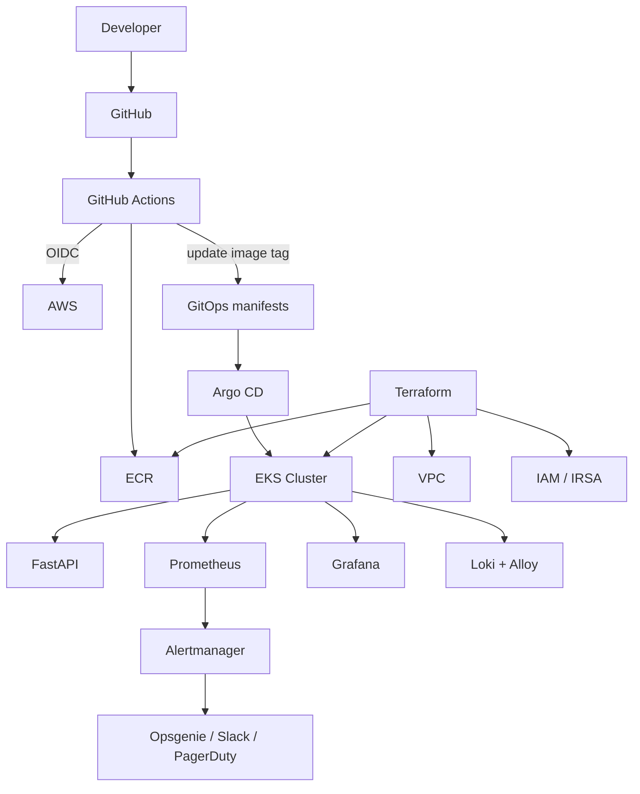

# gitops-eks-platform

[](https://developer.hashicorp.com/terraform)
[](https://aws.amazon.com/eks/)
[](https://argo-cd.readthedocs.io/)
[](https://kubernetes.io/)
[](LICENSE)

A portfolio-grade GitOps platform on AWS EKS using Terraform, GitHub Actions, Argo CD, Prometheus, Grafana, Loki, Alloy, External Secrets, and a sample FastAPI service.

> **Scaffold-only repository:** no AWS credentials, real account IDs, API keys, phone numbers, or cloud-generated identifiers are stored here.

## Architecture



## Repository layout

```text
bootstrap/             Remote state + GitHub OIDC bootstrap
terraform/             Reusable AWS infrastructure modules
.github/workflows/     Infrastructure, application and security CI/CD
apps/sample-api/       FastAPI sample application
charts/sample-api/     Helm chart for the sample application
gitops/                Argo CD applications and platform configuration
scripts/               Operational helper scripts
docs/                  Architecture, security, observability and runbooks
```

## Prerequisites

Install locally:

- AWS CLI
- Terraform 1.9.x
- kubectl
- Helm 3.x
- Git
- Docker
- GitHub repository with Actions enabled

Required AWS/GitHub setup:

1. An AWS account.
2. A globally unique S3 bucket for Terraform state.
3. A DynamoDB table for Terraform locking.
4. GitHub OIDC provider and IAM roles.
5. A GitHub repository containing this project.
6. DNS/Route 53 configuration if exposing the sample application through an ALB.
7. AWS Secrets Manager secret for the Opsgenie integration if alerts are enabled.

## Dummy AWS IDs

The following values are intentionally invalid documentation values:

```text
000000000000
111111111111
```

Never replace a real account ID with either of those values. Use `<AWS_ACCOUNT_ID>` in configuration until the real account is known.

## Quick start

### 1. Bootstrap

```bash
cd bootstrap
cp terraform.tfvars.example terraform.tfvars
# Edit terraform.tfvars with your real values.

terraform init
terraform plan
terraform apply
```

### 2. Provision dev

```bash
cd ../terraform/envs/dev
cp terraform.tfvars.example terraform.tfvars
# Edit the variables.

terraform init
terraform plan
terraform apply
```

### 3. Configure kubectl

Use the EKS cluster name printed by Terraform:

```bash
aws eks update-kubeconfig \
  --region ap-south-1 \
  --name <EKS_CLUSTER_NAME>
```

### 4. Access Argo CD

```bash
kubectl -n argocd get pods
kubectl -n argocd get svc argocd-server
```

For a local demo:

```bash
./scripts/port-forward.sh argocd
```

### 5. Verify GitOps

```bash
kubectl get applications -A
kubectl get applicationsets -A
kubectl get pods -A
```

### 6. Application delivery

A push to the application source can:

1. Run unit tests.
2. Build the image.
3. Scan the image with Trivy.
4. Push the image to ECR using GitHub OIDC.
5. Update `gitops/environments/dev/values-dev.yaml`.
6. Argo CD detects the Git change.
7. Argo CD deploys the new image to dev.

Production promotion is performed through a reviewed Git pull request.

## Demo walkthrough

1. Open Argo CD and show synchronized applications.
2. Open Grafana and show cluster health.
3. Open the sample API `/health`.
4. Generate traffic against `/`.
5. Inspect RED metrics in Grafana.
6. Query application logs in Loki.
7. Change the application image tag.
8. Show Argo CD reconciliation.
9. Trigger the synthetic alert.
10. Demonstrate Alertmanager routing.

## Teardown

> **Warning:** AWS EKS, NAT gateways, load balancers, EBS volumes and other resources can incur charges.

```bash
cd terraform/envs/dev
terraform destroy
```

For production, use the equivalent production directory only after confirming that destroying the environment is intended.

## Troubleshooting

### Argo CD is out of sync

```bash
kubectl -n argocd get applications
kubectl -n argocd describe application <APPLICATION>
```

Check that the Git repository URL and revision are correct.

### Pods are pending

```bash
kubectl get pods -A
kubectl describe pod <POD> -n <NAMESPACE>
kubectl get nodes
```

Check node capacity, taints, affinity and resource requests.

### ALB is not created

```bash
kubectl get ingress -A
kubectl describe ingress <INGRESS> -n <NAMESPACE>
```

Check AWS Load Balancer Controller status and subnet tags.

### Metrics are missing

```bash
kubectl get servicemonitors -A
kubectl get prometheusrules -A
```

Check the ServiceMonitor labels and Prometheus selector.

## Technology stack

| Area | Technology |
|---|---|
| Cloud | AWS |
| Infrastructure | Terraform |
| Compute | EKS |
| Networking | VPC, private/public subnets, NAT |
| CI/CD | GitHub Actions |
| GitOps | Argo CD |
| Containers | Docker |
| Registry | Amazon ECR |
| Packaging | Helm |
| Metrics | Prometheus |
| Dashboards | Grafana |
| Logs | Loki + Alloy |
| Alerting | Alertmanager |
| Secrets | AWS Secrets Manager + External Secrets |
| Security | Trivy, Gitleaks, Checkov |
| Application | FastAPI |

## Screenshots

Replace the placeholders under `docs/images/` with real screenshots.


## Security notes

- GitHub Actions authenticates to AWS using OIDC.
- No long-lived AWS access keys are required.
- Secrets are referenced from AWS Secrets Manager.
- Application containers run as non-root.
- Kubernetes security contexts use restricted settings where possible.
- Trivy blocks HIGH and CRITICAL vulnerabilities.
- Gitleaks scans commits.
- Terraform uses Checkov and TFLint in CI.
- Alerting phone/SMS configuration is intentionally outside Git.

See [docs/security.md](docs/security.md).

## License

MIT.
