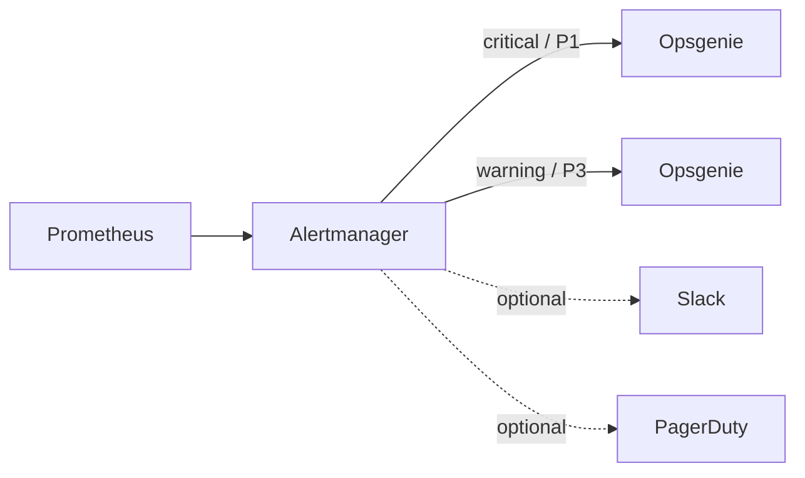

# Alerting

## Routing



Critical alerts are routed to Opsgenie at priority P1.

Warning alerts are routed to Opsgenie at priority P3.

### Secret handling

The Opsgenie API key must be stored in AWS Secrets Manager under:

```text
gitops-eks-platform/opsgenie
```

External Secrets creates the Kubernetes Secret consumed by Alertmanager.

**Never put the API key into Git.**

### Phone/SMS

Phone/SMS delivery is configured in Opsgenie user notification rules. No phone
number is stored in this repository.

This separation means the GitOps repository contains routing policy but not
personal contact information.

### Receiver swapping

The Alertmanager configuration includes comments showing where PagerDuty or
Slack receivers can be substituted. Their credentials should likewise be
provided through Kubernetes Secrets / External Secrets.
